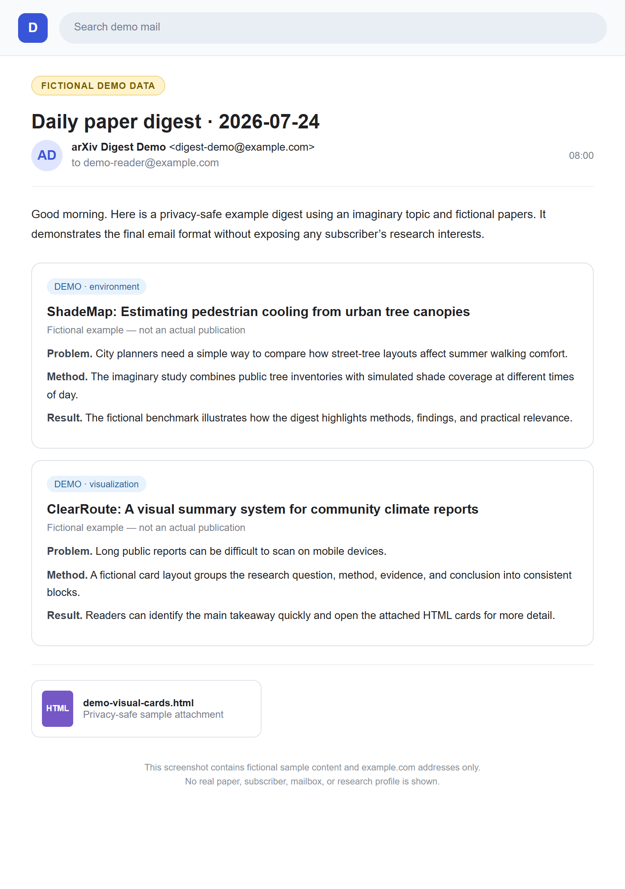
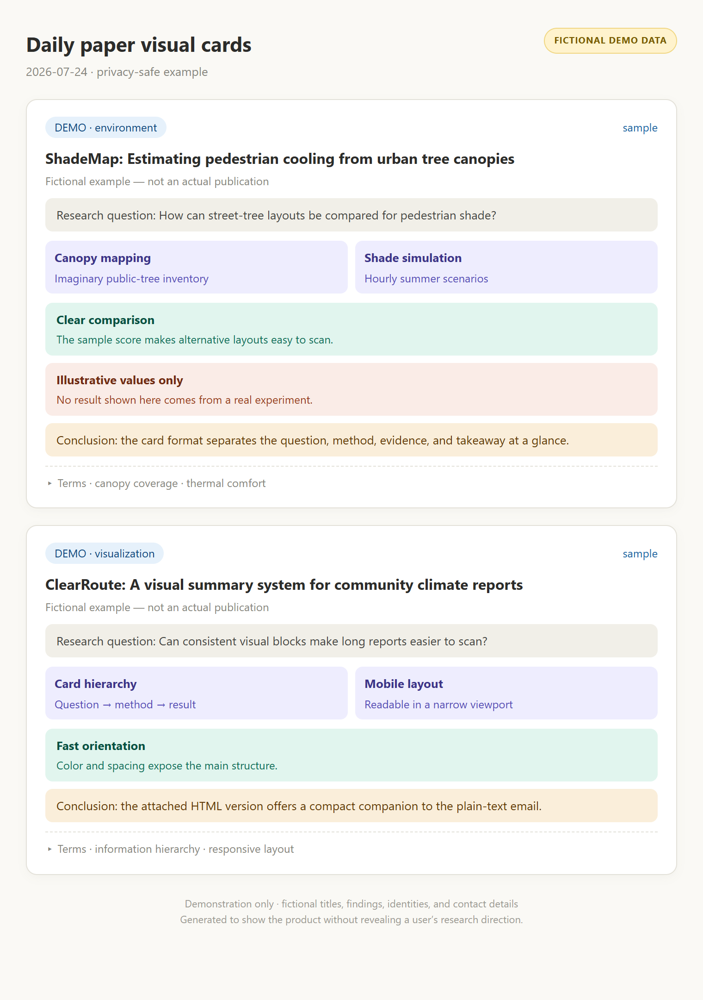

# arXiv Digest Kit · 每日论文简报自动化 · 論文ダイジェスト自動配信

  
  

---

## 中文

每天定时抓取你研究领域的最新 arXiv 论文（可选行业新闻），用你的语言生成摘要
简报和可视化图卡，自动发送到邮箱。运行在云端，电脑关机也照常推送。

**一句话安装** — 对你的编码代理说：

- Claude Code：`安装这个自动化进程 https://github.com/utopiabelmont/arxiv-daily-digest-kit`
- Codex：`Install this automation: https://github.com/utopiabelmont/arxiv-daily-digest-kit`

代理会读取 `INSTALL.md` 向导：先做 3 项前置检查（发信邮箱已开两步验证 /
gh 已登录正确账号 / Claude 路线还需确认 GitHub App 已安装），再用你的语言
问约 11 个问题——简报语言、研究领域（关键词或 Google Scholar/KAKEN/ORCID
链接）、每日篇数偏好、推送时间、发信邮箱服务商（Gmail/Outlook/QQ/163/
其他均可）、收件邮箱、是否要行业新闻、仓库名与可见性、邮件标题、
模型/LLM 提供商、图卡深链打开哪家助手——然后自动完成全部配置。
凡有默认值的问题都可以直接回答"默认"。

**两种运行后端**（向导会帮你选）：

- **A · Claude 云端 Routine**：需 Claude Pro/Max，由 Routine 会话写简报；
- **B · GitHub Actions 定时**：Codex 用户默认走这条；需一个 LLM API Key
  （OpenAI 或 Anthropic），全程跑在 GitHub 云上。

前提：GitHub 账号 + git；一个支持 SMTP 的发信邮箱（应用专用密码/授权码的
生成路径向导会按服务商分别指导）。

### 隐私与数据流

- 邮箱密码 / API Key 只存放在你仓库的 **GitHub 加密 Secrets** 中，写入后任何人（包括你）都无法读回明文；
- 简报、配置与运行历史都存在**你自己的仓库**（默认私有）；不会向本套件作者传输任何数据；
- 后端 B 会把论文标题/摘要与你的领域描述发送给**你选择的** LLM 提供商用于生成摘要；后端 A 在你自己的 Claude 账户内处理。

### 费用参考

| 项目 | 费用 |
|---|---|
| 后端 A（Routine） | 消耗你的 Claude 订阅额度（建议选轻量模型） |
| 后端 B（LLM API） | 约每天几美分，取决于模型与篇数 |
| GitHub Actions | 公共仓库免费；私有仓库使用每月免费分钟数（本任务每天仅数分钟） |

### 停用与卸载

后端 A：在 claude.ai/code/routines 删除或停用该 routine。
后端 B：仓库 Actions → "Daily digest (cron)" → ⋯ → Disable workflow。
彻底卸载：另外撤销邮箱应用专用密码/授权码，删除仓库 Secrets，（可选）删除整个仓库。

### 没有编码代理？手动安装

也可以人工照 `INSTALL.md` 执行：复制本仓库文件 → 参照 `config.example.json`
写出 `config.json` → 用 `templates/` 生成对应 workflow → 设置 3–4 个
Secrets →（后端 A）创建 routine。全程不需要安装任何 pip 依赖。

---

## English

Fetches the newest arXiv papers in your field every day (industry news
optional), writes a digest **in your language** plus visual summary cards,
and emails them to you. Runs fully in the cloud — your machine can stay off.

**One-line install** — tell your coding agent:

- Claude Code: `Install this automation: https://github.com/utopiabelmont/arxiv-daily-digest-kit`
- Codex: `Install this automation: https://github.com/utopiabelmont/arxiv-daily-digest-kit`

The agent reads `INSTALL.md`: it runs 3 pre-checks (two-step verification on
your sending mailbox / `gh` logged into the right account / for the Claude
path, the GitHub App actually installed), then interviews you in your
language — about 11 questions covering digest language, research field
(keywords or your Google Scholar / KAKEN / ORCID URL), papers-per-day
preference, push time, sending-email provider (Gmail / Outlook / QQ / 163 /
other), recipient address, industry news yes-no, repo name & visibility,
subject line, model / LLM provider, and which assistant the card deep-links
open — then configures everything. Answer "default" to any question that
offers one.

**Two execution backends** (the wizard picks with you):

- **A · Claude cloud Routine** — needs Claude Pro/Max; the Routine session
  writes the digest.
- **B · GitHub Actions cron** — default for Codex users; needs one LLM API
  key (OpenAI or Anthropic); everything runs on GitHub.

Prerequisites: a GitHub account + git; any SMTP-capable sending mailbox
(the wizard gives provider-specific app-password / auth-code steps).

### Privacy & data flow

- Mail passwords / API keys live only in your repo's **encrypted GitHub
  Secrets**; once written, nobody (including you) can read them back;
- Digests, config, and run history stay in **your own repo** (private by
  default); nothing is ever sent to the kit's author;
- Backend B sends paper titles/abstracts plus your field description to
  **the LLM provider you chose**; Backend A processes everything inside
  your own Claude account.

### Cost reference

| Item | Cost |
|---|---|
| Backend A (Routine) | Uses your Claude subscription quota (pick a light model) |
| Backend B (LLM API) | Roughly a few cents/day, depending on model & volume |
| GitHub Actions | Free on public repos; private repos use the monthly free minutes (this job takes a few minutes/day) |

### Disable & uninstall

Backend A: delete or pause the routine at claude.ai/code/routines.
Backend B: repo Actions → "Daily digest (cron)" → ⋯ → Disable workflow.
Full uninstall: also revoke the mail app password / auth code, delete the
repo Secrets, and (optionally) delete the repo.

### No coding agent? Manual install

Follow `INSTALL.md` by hand: copy the files → write `config.json` from
`config.example.json` → generate the workflow from `templates/` → set the
3–4 Secrets → (Backend A) create the routine. Zero pip dependencies.

---

## 日本語

毎日決まった時刻に、あなたの研究分野の最新 arXiv 論文（業界ニュースは任意）
を取得し、**指定した言語**でダイジェストとビジュアル要約カードを生成して
メールで届けます。すべてクラウド上で動作し、PC の電源が切れていても配信されます。

**ワンライン・インストール** — コーディングエージェントに次のように伝えてください：

- Claude Code：`このオートメーションをインストールして https://github.com/utopiabelmont/arxiv-daily-digest-kit`
- Codex：`Install this automation: https://github.com/utopiabelmont/arxiv-daily-digest-kit`

エージェントは `INSTALL.md` を読み、まず 3 つの事前チェック（送信メールの
2 段階認証 / gh の正しいアカウントへのログイン / Claude 経路の場合は
GitHub App のインストール確認）を行い、続いてあなたの言語で約 11 の質問
——ダイジェストの言語、研究分野（キーワードまたは Google Scholar・KAKEN・
ORCID の URL）、1 日の論文数の希望、配信時刻、送信メールプロバイダ
（Gmail / Outlook / QQ / 163 / その他）、受信アドレス、業界ニュースの要否、
リポジトリ名と公開設定、件名、モデル / LLM プロバイダ、カードのディープ
リンクで開くアシスタント——に答えるだけで、設定は自動で完了します。
デフォルトがある質問には「デフォルトで」と答えられます。

**2 つの実行バックエンド**（ウィザードが一緒に選びます）：

- **A · Claude クラウド Routine** — Claude Pro/Max が必要。
- **B · GitHub Actions cron** — Codex ユーザーはこちらが既定。LLM API キー
  （OpenAI または Anthropic）が必要で、全処理が GitHub 上で完結します。

前提条件：GitHub アカウント + git、SMTP 送信可能なメールアカウント
（アプリパスワード / 授権コードの取得手順はプロバイダ別にウィザードが案内します）。

### プライバシーとデータの流れ

- メールパスワード / API キーはあなたのリポジトリの**暗号化された GitHub
  Secrets** のみに保存され、書き込み後は誰も平文を読み出せません；
- ダイジェスト・設定・実行履歴は**あなた自身のリポジトリ**（既定で非公開）に
  保存され、本キットの作者には一切送信されません；
- バックエンド B は論文タイトル/アブストラクトと分野説明を**あなたが選んだ**
  LLM プロバイダへ送信します。バックエンド A はあなたの Claude アカウント内で
  処理されます。

### 費用の目安

| 項目 | 費用 |
|---|---|
| バックエンド A（Routine） | Claude サブスクリプションの利用枠を消費（軽量モデル推奨） |
| バックエンド B（LLM API） | モデルと件数により、おおよそ 1 日数セント |
| GitHub Actions | 公開リポジトリは無料；非公開は毎月の無料枠内（本ジョブは 1 日数分） |

### 停止とアンインストール

バックエンド A：claude.ai/code/routines で routine を削除または停止。
バックエンド B：リポジトリの Actions → "Daily digest (cron)" → ⋯ →
Disable workflow。完全に削除する場合は、アプリパスワード / 授権コードの
無効化、Secrets の削除、（任意で）リポジトリ自体の削除も行ってください。

### エージェントなしで使う（手動インストール）

`INSTALL.md` に沿って手動でも構築できます：ファイルをコピー →
`config.example.json` を参考に `config.json` を作成 → `templates/` から
workflow を生成 → Secrets を 3–4 件設定 →（A の場合）routine を作成。
pip 依存はゼロです。

---

### Architecture / 架构 / 構成

fetch (arXiv API + Google News RSS) → LLM digest & cards → commit to your
repo → GitHub Action emails body + HTML card attachment.
Cross-day dedup · timezone-aware dating · multi-provider SMTP · zero pip deps.

### Credits & data sources / 致谢 / 謝辞

Paper data from the [arXiv API](https://info.arxiv.org/help/api/index.html)
(thank you to arXiv for use of its open access interoperability; please keep
polite request rates). News via Google News RSS. Email delivery by
[dawidd6/action-send-mail](https://github.com/dawidd6/action-send-mail).
Built and iterated with Claude Code / Codex agents.

### License

MIT — see [LICENSE](LICENSE).
